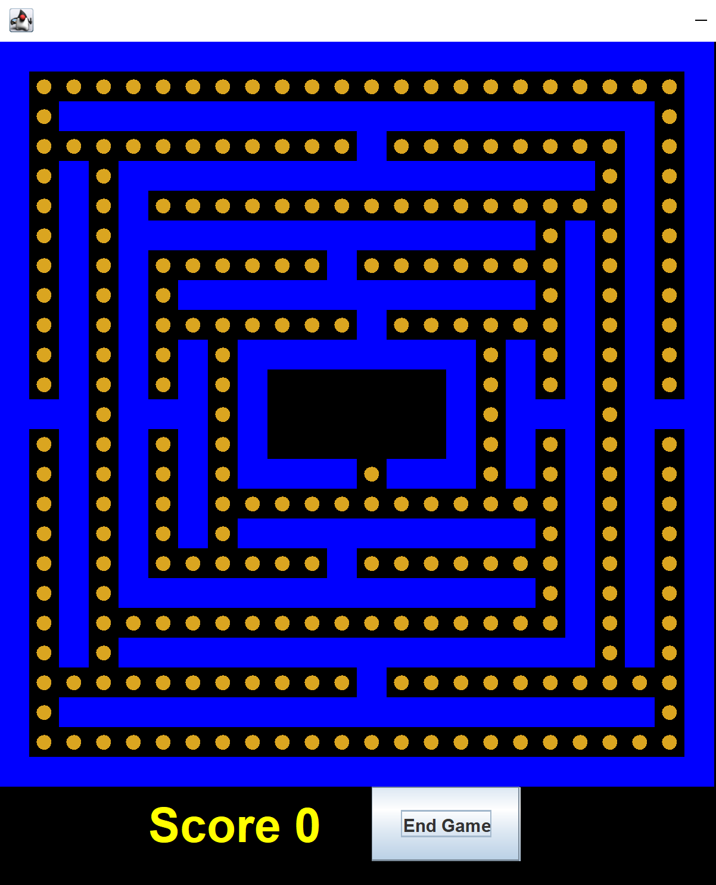

### We all worked on this README in collaboration. Everyone wrote the descriptions for their methods.

<p>&nbsp;</p>

# Project 3: PacMan

# Group Members:
  Kishore Nagarajan, Richard Bui, Tina Le, Adrian Paras
<p>&nbsp;</p>

# How to Run the Game:

```bash
javac -cp "src/" src/*.java
java -cp "src/" StartMenu
```

# Function Descriptions

## PacMan Class

### get_valid_moves()
This function returns all of the valid moves from where PacMan is currently. A valid move is any location coordinate that does not contain a wall and is within range.
  
### move()
  This method uses the get_valid_moves method to find the possible locations that PacMan 
  can move, given his current location. The method then chooses to move in one of those directions.

### is_ghost_in_range()
  Check nearby locations (left, right, up, down) to see if a Ghost is there. Return true if there is a ghost in one of these locations else false.

### consume()

  This function checks if there is a ‘power-cookie’ located in PacMan’s current (x, y) coordinate. If there is, this method calls eatCookie() from the Map class, and returns the cookie component if the cookie is consumed, and null otherwise. 

<p>&nbsp;</p>

## Ghost Class

### get_valid_moves()
  Returns an ArrayList of possible move locatiosn for the Ghost. Check (left, right, up, down) to see if Ghost is allowed to move there and return these possible locations.

### move()
  This function uses the get_valid_moves function to find the possible locations that a ghost can 
  move to from its current location and chooses to move in one of those directions.

### is_pacman_in_range()
This function checks to see if PacMan is within range by checking if the map contains a type PACMAN directly above, below, left, or to the right of the ghost.

### attack()
  This function checks to see if PacMan is within range attack by calling the is_pacman_in_range function. If it is in range, attack PacMan and return true. Otherwise, return false.


<p>&nbsp;</p>

## Map Class

### move(String name, Location loc, Type type)
This function updates the locations, components, and field of the map. It will update the location of the associated type and name of object inputted by the user.

### getLoc(Location loc)
For the given location argument, returns what is currently at the location 
(Empty, Pacman, Cookie, Ghost, Wall).

### attack(String name)
  This function controls ghosts attacking PacMan. If the ghost was able to successfully attack PacMan and update the display, return true. Otherwise, return false.

### eatCookie(String Name)
This method's purpose is to control Pacman eating a cookie. If Pacman is able to eat the Cookie, the display is updated and the component eaten is returned.

<p>&nbsp;</p>

# Function Testing

## PacMan Class

### get_valid_moves()
A PacMan is added to the frame. In this case, it’s added at coordinates (1, 1). There should only be two valid moves from this coordinate. Another PacMan is added (pacman2) at coordinates (1, 3). Here, there should be three valid moves.
  
### move()
Creates a map and adds a pacman at location (9, 11). We check that at 
this point, there are no available moves pacman can make. We then add a
cookie at location (9, 12), and at this point, pacman should be able to move
to this position.

### is_ghost_in_range()
  Starting with an empty frame, placed just Pacman on the board. In this scenario, there should be no ghost in 
  range so false should be returned. After placing a Ghost in a location adjacent to Pacman, the method is called
  again as we should expect True since a ghost is nearby.


### consume()

A PacMan is added to the frame. In this case, it’s added at coordinates (0, 0). Since there is no cookie at PacMan’s current coordinates, check that pacman.consume() returns null. Another PacMan is added (pacman2) at coordinates (1, 1). We ensure a cookie is located at the same coordinates and that calling consume() on the newly added PacMan will not return null. A cookie component is returned instead.


<p>&nbsp;</p>

## Ghost Class

### get_valid_moves()
  On the pre-built Mainframe, setting Pacman to position (1,1) where there are only two possible moves on this location of the board.
  Additionally, check at position (1,3) Pacman has three possible moves. These values were observed based on the pre-set values of the Mainframe 
  board.

### move()
Creates a map and adds a ghost at location (9, 11). We check that at 
this point, there are no available moves pacman can make. We then add a
cookie at location (9, 12), and at this point, the ghost should be able to move
to this position.

### is_pacman_in_range()
A ghost (ghost1) is added to the frame with coordinates (5, 6). Verify that when no PacMan exists nearby and should return false. A PacMan (pacman) is added to the frame with coordinates (5, 5). Because PacMan is within range of the ghost, ghost1.is_pacman_in_range() should still return true. 


### attack()
  A ghost (ghost1) is added to the frame with coordinates (9, 11). Verify that when no PacMan exists, ghost1.attack() is unsuccessful and returns false. A PacMan (pacman) is added to the frame with coordinates (1, 1). Because PacMan is not within range of the ghost, ghost1.attack() should still return false. Add another pacman (pacman2) with coordinates (9, 12). Now that there is a PacMan in range, ghost1.attack() should return true. 


<p>&nbsp;</p> 

## Map Class

### move(String name, Location loc, Type type)
Creates a general map in the frame. It will then call move on a pacman in the map, which should return true. However, calling move on a wall which is another type in the Map class  should return false because we should not be able to move walls. 

### getLoc(Location loc)
Verifies that when nothing is at a certain location in the map (in this case (9, 11),
the function would return null. When adding locations (9, 11) and (9, 12), with types cookie
and wall, we verify that calling the function with it's toString() representation
gives us the correct corresponding type.

### attack(String name)
  Checks that when a ghost with specified name doesn’t exist, map.attack returns false and the game is still not over. When a ghost is added to the frame with a location 1 radius away from PacMan, we verify that it can successfully attack PacMan and the game is now over.

### eatCookie(String Name)
  Using the Mainframe map and its preset cookie locations, first check if a random "test" string exists in the map. This should return null as something named
  "test" should not exist. Additionally, pacman is set to location (1,1) where a cookie was preset on the MainFrame. This should return a non-null component since
  a cookie could be eaten.

<p>&nbsp;</p> 

## Game Image

